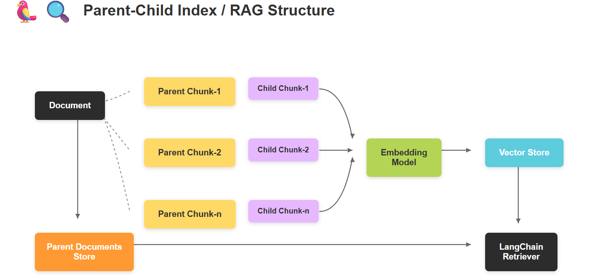
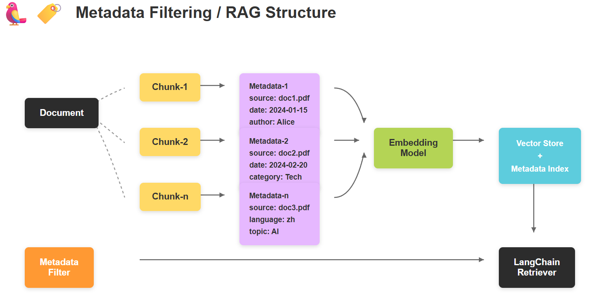

## Advanced RAG

**学习目标:**

1. 熟悉 Advanced RAG的基本作用
2. 熟悉 前索引优化方式
3. 熟悉 查询优化方式
4. 熟悉 后索引优化方式


### 一. Advanced RAG概述

Advanced RAG重点聚焦在检索增强，即优化Retrieval阶段。增加了Pre-Retrieval预检索和Post-Retrieval后检索阶段。 


基于朴素RAG，高级RAG主要通过预检索策略和后检索策略来提升检索质量。

**预检索过程**

高级RAG着重优化了索引结构和查询的方式。优化索引旨在提高被索引内容的质量，包括增强数据颗粒度、优化索引结构、添加元数据、对齐优化和混合检索等策略。查询优化的目标则是明确用户的原始问题，使其更适合检索任务，使用了**查询重写、查询转换、查询扩展**等技术。

**后检索过程**

对于由问题检索得到的一系列上下文，后检索策略关注如何优化它们与查询问题的集成。这一过程主要包括**重新排序和压缩上下文**。重新排列检索到的信息，将最相关的内容予以定位标记，这种策略已经在LlamaIndex2、LangChain等框架中得以实施。直接将所有相关文档输入到大型语言模型（LLMs）可能导致信息过载，为了缓解这一点，后检索工作集中选择必要的信息，强调关键部分，并限制了了相应的上下文长度。


### 二. Pre-Retrieval预检索-优化索引

#### 1. 摘要索引

##### 1.1 痛点分析 

在处理大量文档时，如何快速准确地找到所需信息是一个常见挑战。摘要索引可以用来处理半结构化数据，比如许多文档包含多种内容类型，包括文本和表格。这种半结构化数据对于传统 RAG 来说可能具有挑战性，文本拆分可能会分解表，从而损坏检索中的数据；嵌入表可能会给语义相似性搜索带来挑战。

 

##### 1.2 **解决思路:**

- 让LLM为每个块生成summary，并作为embedding存到summary database中
- 在检索时，通过summary database找到最相关的summary，再回溯到原始文档中去
- 将原始文本块作为上下文发送给LLM以获取答案

##### 1.3 **整体代码**

```
from langchain.storage import InMemoryByteStore
from langchain_chroma import Chroma
from langchain_community.document_loaders import UnstructuredWordDocumentLoader, WebBaseLoader
from langchain_text_splitters import RecursiveCharacterTextSplitter
from langchain_openai.chat_models import ChatOpenAI
from langchain.retrievers import MultiVectorRetriever
import uuid
from langchain_core.documents import Document
from langchain_core.output_parsers import StrOutputParser
from langchain_core.prompts import ChatPromptTemplate
from langchain_core.runnables import RunnableMap
from langchain_huggingface import HuggingFaceEmbeddings
import os
from dotenv import load_dotenv

load_dotenv()

# 本地embedding模型地址
embedding_model_path = r'D:\LLM\Local_model\BAAI\bge-large-zh-v1___5'

url = "https://news.pku.edu.cn/mtbdnew/15ac0b3e79244efa88b03a570cbcbcaa.htm"
# 初始化文档加载器列表（加载多个文本文件）
loaders = [
    UnstructuredWordDocumentLoader("人事管理流程.docx"),
    WebBaseLoader(url)
]

# 加载并合并所有文档
docs = []
for loader in loaders:
    docs.extend(loader.load())
# print(docs)
# 初始化递归文本分割器（设置块大小和重叠）
text_splitter = RecursiveCharacterTextSplitter(chunk_size=1024, chunk_overlap=100)
docs = text_splitter.split_documents(docs)
# print(docs)

llm = ChatOpenAI(
    model="qwen-plus",
    api_key=os.getenv("api_key"),
    base_url=os.getenv("base_url")
)

# 创建摘要生成链
chain = (
        {"doc": lambda x: x.page_content}
        | ChatPromptTemplate.from_template("总结下面的文档:\n\n{doc}")
        | llm
        | StrOutputParser()
)

# 批量生成文档摘要（最大并发数5）
summaries = chain.batch(docs, {"max_concurrency": 5})
# print(summaries)

# 初始化嵌入模型（用于文本向量化）
embeddings_model = HuggingFaceEmbeddings(
    model_name=embedding_model_path
)
# 初始化Chroma实例（用于存储摘要向量）
vectorstore = Chroma(
    collection_name="summaries",
    embedding_function=embeddings_model
)

# 初始化内存字节存储（用于存储原始文档）
store = InMemoryByteStore()


# 初始化多向量检索器（结合向量存储和文档存储）
id_key = "doc_id"
retriever = MultiVectorRetriever(
    vectorstore=vectorstore,
    byte_store=store,
    id_key=id_key,
)

# 为每个文档生成唯一ID
doc_ids = [str(uuid.uuid4()) for _ in docs]

# 创建摘要文档列表（包含元数据） metadata可以用来关联原始文档和摘要文档会自动找到匹配关系
summary_docs = [
    Document(page_content=s, metadata={id_key: doc_ids[i]}) for i, s in enumerate(summaries)
]

# 将摘要添加到向量数据库
retriever.vectorstore.add_documents(summary_docs)

# 将原始文档存储到字节存储（使用ID关联）
retriever.docstore.mset(list(zip(doc_ids, docs)))


# 执行相似性搜索测试
sub_docs = retriever.vectorstore.similarity_search("病假的请假流程?")
print("-------------匹配的摘要内容--------------")
print(sub_docs[0])

# 获取第一个匹配摘要的ID
matched_id = sub_docs[0].metadata[id_key]

# 通过ID获取原始文档
original_doc = retriever.docstore.mget([matched_id])
print("-------------对应的原始文档--------------")
print(original_doc)


prompt = ChatPromptTemplate.from_template("根据下面的文档回答问题:\n\n{doc}\n\n问题: {question}")
# 生成问题回答链
chain = RunnableMap({
    "doc": lambda x: retriever.get_relevant_documents(x["question"]),
    "question": lambda x: x["question"]
}) | prompt | llm | StrOutputParser()

# 生成问题回答
query = "病假的请假流程?"
answer = chain.invoke({"question": query})
print("-------------回答--------------")
print(answer)

retrieved_docs = retriever.invoke(query)
print("-------------检索到的文档--------------")
print(retrieved_docs)

```


#### 2. 父子索引

##### 2.1 痛点分析

我们在利用大模型进行文档检索的时候，常常会有相互矛盾的需求，比如：

1. 你可能希望得到较小的文档块，以便它们Embedding以后能够最准确地反映出文档的含义，如果文档块太大，Embedding就失去了意义。
2. 你可能希望得到较大的文档块以保留较多的内容，然后将它们发送给LLM以便得到全面且正确的答案。



##### 2.2 **解决思路:**

父文档检索重点解决这种问题，基本思路：

- 文档被分割成一个层级化的块结构，随后用最小的叶子块进行索引
- 在检索过程中检索出top k个叶子块
- 如果存在n个叶子块都指向同一个更大的父块，那么我们就用这个父块来替换这些子块，并将其送入大模型用于生成答案。

##### 2.3 完整代码

```
from langchain_community.document_loaders import WebBaseLoader
import os
from langchain_text_splitters import RecursiveCharacterTextSplitter
from langchain_chroma import Chroma
from langchain.retrievers import ParentDocumentRetriever
from langchain_core.stores import BaseStore, InMemoryByteStore
from langchain_core.documents import Document
import pymysql
import json
from langchain_openai.chat_models import ChatOpenAI
from langchain_core.prompts import ChatPromptTemplate
from langchain_core.runnables import RunnableMap
from langchain_core.output_parsers import StrOutputParser
from langchain_huggingface import HuggingFaceEmbeddings
from dotenv import load_dotenv

load_dotenv()

# 自定义 MySQL Store
class MySQLStore(BaseStore):
    def __init__(self, host, user, password, database):
        self.connection = pymysql.connect(
            host=host,
            user=user,
            password=password,
            database=database,
            cursorclass=pymysql.cursors.DictCursor
        )
        self._create_table()

    def _create_table(self):
        with self.connection.cursor() as cursor:
            cursor.execute("""
                CREATE TABLE IF NOT EXISTS documents (
                    doc_id VARCHAR(255) PRIMARY KEY,
                    page_content TEXT,
                    metadata JSON
                )
            """)
            self.connection.commit()

    def mset(self, key_value_pairs):
        with self.connection.cursor() as cursor:
            for key, doc in key_value_pairs:
                metadata = json.dumps(doc.metadata) if doc.metadata else "{}"
                cursor.execute("""
                    INSERT INTO documents (doc_id, page_content, metadata)
                    VALUES (%s, %s, %s)
                    ON DUPLICATE KEY UPDATE page_content=%s, metadata=%s
                """, (key, doc.page_content, metadata, doc.page_content, metadata))
            self.connection.commit()

    def mget(self, keys):
        with self.connection.cursor() as cursor:
            if not keys:
                return []
            placeholders = ", ".join(["%s"] * len(keys))
            cursor.execute(f"SELECT doc_id, page_content, metadata FROM documents WHERE doc_id IN ({placeholders})", keys)
            results = cursor.fetchall()
            return [Document(page_content=row["page_content"], metadata=json.loads(row["metadata"]) if row["metadata"] else {}) for row in results]

    def mdelete(self, keys):
        with self.connection.cursor() as cursor:
            if not keys:
                return
            placeholders = ", ".join(["%s"] * len(keys))
            cursor.execute(f"DELETE FROM documents WHERE doc_id IN ({placeholders})", keys)
            self.connection.commit()

    def yield_keys(self):
        with self.connection.cursor() as cursor:
            cursor.execute("SELECT doc_id FROM documents")
            for row in cursor.fetchall():
                yield row["doc_id"]

    def close(self):
        self.connection.close()

# 本地 embedding 模型地址
embedding_model_path = r'D:\LLM\Local_model\BAAI\bge-large-zh-v1___5'

# 目标 URL
url = "https://news.pku.edu.cn/mtbdnew/15ac0b3e79244efa88b03a570cbcbcaa.htm"

# 加载网页
loader = WebBaseLoader(url)
docs = loader.load()

# 创建主文档分割器
parent_splitter = RecursiveCharacterTextSplitter(chunk_size=1000)

# 创建子文档分割器
child_splitter = RecursiveCharacterTextSplitter(chunk_size=400)

# 初始化嵌入模型
embeddings_model = HuggingFaceEmbeddings(model_name=embedding_model_path)

# 创建向量数据库对象
vectorstore = Chroma(collection_name="split_parents", embedding_function=embeddings_model)

# 创建 MySQL 存储对象
store = MySQLStore(host="localhost", user="root", password="root", database="langchain_db")

# 初始化内存字节存储（用于存储原始文档）
# store = InMemoryByteStore()

# 创建父文档检索器
retriever = ParentDocumentRetriever(
    vectorstore=vectorstore,
    docstore=store,
    child_splitter=child_splitter,
    parent_splitter=parent_splitter,
    search_kwargs={"k": 1}
)

# 添加文档集
retriever.add_documents(docs)

print(f"存储的父文档数量: {len(list(store.yield_keys()))}")

print("------------similarity_search------------------------")
# 在向量数据库中搜索子文档
sub_docs = vectorstore.similarity_search("天才AI少女是谁？")
print(sub_docs)

print("------------get_relevant_documents------------------------")
# 过程 retriever.invoke 先检索子文档，根据子文档的元数据找到父文档
retrieved_docs = retriever.invoke("天才AI少女是谁？")
print(retrieved_docs[0].page_content)

# 创建模型
llm = ChatOpenAI(
    model="qwen-plus",
    api_key=os.getenv("DASHSCOPE_API_KEY"),
    base_url=os.getenv("DASHSCOPE_BASE_URL")
)

# 创建 prompt 模板
template = """请根据下面给出的上下文来回答问题:
{context}
问题: {question}
"""

# 由模板生成 prompt
prompt = ChatPromptTemplate.from_template(template)

# 创建 chain
chain = RunnableMap({
    "context": lambda x: retriever.invoke(x["question"]),
    "question": lambda x: x["question"]
}) | prompt | llm | StrOutputParser()

print("------------模型回复------------------------")

response = chain.invoke({"question": "天才AI少女是谁？"})
print(response)

# 关闭 MySQL 连接
store.close()
```


#### 3. 假设性问题索引

##### 3.1 问题解决

假设性问题是一种提问方式，它基于一个或多个假设的情况或前提来提出问题。在对知识库中文档内容进行切片时，是可以以该切片为假设条件，利用LLM预先设置几个候选的相关性问题的，也就是说，这几个候选的相关性问题是和切片的内容强相关的。 (先把文档对应的问题和答案预设好,问题存向量,答案存文档)

##### 3.2 **解决思路:** 

- 让LLM为每个块生成3个假设性问题，并将这些问题以向量形式嵌入
- 在运行时，针对这个问题向量的索引进行查询搜索（用问题向量替换文档的块向量）
- 检索后将原始文本块作为上下文发送给LLM以获取答案

##### 3.3 完整代码

```
from typing import List
from langchain.storage import InMemoryByteStore
from langchain_chroma import Chroma
from langchain_community.document_loaders import TextLoader
from langchain_text_splitters import RecursiveCharacterTextSplitter
from langchain_openai.chat_models import ChatOpenAI
from langchain_community.embeddings.dashscope import DashScopeEmbeddings
from langchain.retrievers import MultiVectorRetriever
from langchain_core.documents import Document
from langchain_core.output_parsers import StrOutputParser
from langchain_core.prompts import ChatPromptTemplate
from langchain_core.runnables import RunnableMap
from langchain_huggingface import HuggingFaceEmbeddings
from pydantic import BaseModel, Field
import uuid
import os
from dotenv import load_dotenv

load_dotenv()


# 本地embedding模型地址
embedding_model_path = r'D:\LLM\Local_model\BAAI\bge-large-zh-v1___5'
# 初始化嵌入模型（用于文本向量化）
embeddings_model = HuggingFaceEmbeddings(
    model_name=embedding_model_path
)

# 初始化文档加载器列表
loader = TextLoader("deepseek介绍.txt", encoding="utf-8")
docs = loader.load()

# 初始化递归文本分割器（设置块大小和重叠）
text_splitter = RecursiveCharacterTextSplitter(chunk_size=1024, chunk_overlap=100)
docs = text_splitter.split_documents(docs)

# 初始化llm
llm = ChatOpenAI(
    model="qwen-plus",
    api_key=os.getenv("api_key"),
    base_url=os.getenv("base_url")
)


class HypotheticalQuestions(BaseModel):
    """生成假设性问题"""
    # Field  ... 必传字段  问题必须是列表  对接受的数据进行效验限制
    questions: List[str] = Field(..., description="List of questions")


prompt = ChatPromptTemplate.from_template(
    """请基于以下文档生成3个假设性问题（必须使用JSON格式）:
    {doc}

    要求：
    1. 输出必须为合法JSON格式，包含questions字段
    2. questions字段的值是包含3个问题的数组
    3. 使用中文提问
    示例格式：
    {{
        "questions": ["问题1", "问题2", "问题3"]
    }}"""
)

# 创建假设性问题链
chain = (
        {"doc": lambda x: x.page_content}
        | prompt
        # 将LLM输出构建为字符串列表
        | llm.with_structured_output(HypotheticalQuestions)
        # 提取问题列表
        | (lambda x: x.questions)
)
# 在单个文档上调用链输出问题列表：
# print(chain.invoke(docs[0]))


# 批量处理所有文档生成假设性问题（最大并行数5）
hypothetical_questions = chain.batch(docs, {"max_concurrency": 5})
print(hypothetical_questions)

# 初始化Chroma向量数据库（存储生成的问题向量）
vectorstore = Chroma(
    collection_name="hypo-questions", embedding_function=embeddings_model
)
# 初始化内存存储（存储原始文档）
store = InMemoryByteStore()

id_key = "doc_id"  # 文档标识键名

# 配置多向量检索器
retriever = MultiVectorRetriever(
    vectorstore=vectorstore,
    byte_store=store,
    id_key=id_key,
)

# 为每个原始文档生成唯一ID
doc_ids = [str(uuid.uuid4()) for _ in docs]

# 将生成的问题转换为带元数据的文档对象
question_docs = []
for (i, question_list) in enumerate(hypothetical_questions):
    question_docs.extend(
        [Document(page_content=s, metadata={id_key: doc_ids[i]}) for s in question_list]
    )

retriever.vectorstore.add_documents(question_docs)  # 将问题文档存入向量数据库
retriever.docstore.mset(list(zip(doc_ids, docs)))  # 将原始文档存入字节存储（通过ID关联）

# 执行相似性搜索测试
query = "deepseek受到哪些攻击？"
sub_docs = retriever.vectorstore.similarity_search(query)
print(sub_docs)


prompt1 = ChatPromptTemplate.from_template("根据下面的文档回答问题:\n\n{doc}\n\n问题: {question}")

# 生成问题回答链
chain = RunnableMap({
    "doc": lambda x: retriever.invoke(x["question"]),
    "question": lambda x: x["question"]
}) | prompt1 | llm | StrOutputParser()

# 生成问题回答
answer = chain.invoke({"question": query})
print("-------------回答--------------")
print(answer)
```


#### 4. 元数据索引

##### 4.1 痛点分析

对于大量的文档仅仅依赖语义相似性有时是不够的。想象一下，你想在一个医学文献数据库中查找关于“糖尿病足”的资料，但数据库中也充斥着大量关于其他糖尿病并发症的信息。仅仅依靠向量相似性，可能会检索出许多与你的目标并不完全相关的文档。 




##### 4.2 **解决思路:**

- 存入数据之前先给数据打上标签(作者,时间等一些标签), 有点类似摘要区别在于摘要是总结,元数据是存字段
- 元数据是对文档的一种属性描述，假设我们使用一个存储了大量科技博客文章的向量数据库。每篇文章都关联了以下标签： 

```
  topic: 人工智能, 区块链, 云计算, 大数据
  author: 作者A, 作者B, 作者C
  year: 2022, 2023, 2024
```

- 我们就可以通过标签先对文档进行过滤，然后再进行相似性检索

⚠️ 经测试英文的元数据要比中文检测的结果要准确

- 在 langchain 中使用`SelfQueryRetriever`自查询检索器实现，具体思路：
  - 给定任何自然语言查询，检索器使用查询构造LLM链编写结构化查询，然后将该结构化查询应用于其底层[向量存储](https://python.langchain.com/docs/concepts/vectorstores/)。这允许检索器不仅使用用户输入查询与存储文档的内容进行语义相似性比较，还可以从用户对存储文档元数据的查询中提取过滤器并执行这些过滤器。

##### 4.3 完整代码

```
from langchain_chroma import Chroma
from 元数据文档 import docs, metadata_field_info
from langchain.retrievers.self_query.base import SelfQueryRetriever
from langchain_openai import ChatOpenAI
from langchain_huggingface import HuggingFaceEmbeddings
import os
from dotenv import load_dotenv

load_dotenv()


# 本地embedding模型地址
embedding_model_path = r'D:\LLM\Local_model\BAAI\bge-large-zh-v1___5'
# 初始化嵌入模型（用于文本向量化）
embeddings_model = HuggingFaceEmbeddings(
    model_name=embedding_model_path
)

# 文档内容描述（指导LLM理解文档内容）
document_content_description = "Brief description of technical articles"

llm = ChatOpenAI(
    model="qwen-plus",
    api_key=os.getenv("DASHSCOPE_API_KEY"),
    base_url=os.getenv("DASHSCOPE_BASE_URL")
)
# 创建向量数据库
vectorstore = Chroma.from_documents(docs, embeddings_model)

# 创建自查询检索器（核心组件）
"""
SelfQueryRetriever.from_llm解析步骤:
1. 用户的问题("2023年评分超过8分的机器学习论文")
    LLM 任务(会由底层源码自己实现)：
    识别用户意图中的显式条件（如“2023年”对应 year=2023）。
    提取隐式语义关键词（如“机器学习论文”作为向量搜索关键词）。
    将模糊表述转换为结构化操作符（如“超过8分” → {"$gt": 8}）。
    {
        "query": "机器学习论文",
        "filter": {"year": 2023, "rating": {"$gt": 8}}
    }

2. 元数据过滤
    根据 filter 对向量数据库中的文档元数据进行筛选。(筛选出 year=2023 且 rating>8 的所有文档。)

3. 语义搜索
    在元数据过滤后的文档子集中，用 query 进行向量相似性搜索。

4. 结果合并与排序
    综合元数据匹配度（如完全匹配 year=2023）和语义相关性（向量得分），返回排序后的文档列表

"""
retriever = SelfQueryRetriever.from_llm(
    llm,
    vectorstore,
    document_content_description,
    metadata_field_info,
    # enable_limit 启用限制查询数量
    enable_limit=True
)


# print(retriever.invoke("作者B在2024年发布的文章"))
# 限定查询的数量需要设置enable_limit=True
print(retriever.invoke("我想了解一篇评分在9分以上的文章"))
```

- 元数据文档

```
from langchain_core.documents import Document
from langchain.chains.query_constructor.schema import AttributeInfo

docs = [
    Document(
        page_content="作者A团队开发出基于深度学习的图像识别系统，在复杂场景下的识别准确率提升250%",
        metadata={"year": 2025, "rating": 9.3, "genre": "AI", "author": "A"},
    ),
    Document(
        page_content="物联网技术成功应用于智能农业监控，作者B主导的项目实现农作物产量提升20%",
        metadata={"year": 2024, "rating": 9.5, "genre": "IoT", "author": "B"},
    ),
    Document(
        page_content="边缘计算平台实现实时数据处理突破，作者C构建的新型架构支持千万级并发计算",
        metadata={"year": 2023, "rating": 8.8, "genre": "Edge Computing", "author": "C"},
    ),
    Document(
        page_content="机器学习模型预测2025年股市趋势，作者A团队构建的模型准确率超95%",
        metadata={"year": 2024, "rating": 9.0, "genre": "Machine Learning", "author": "A"},
    ),
    Document(
        page_content="基于人工智能的心脏病诊断系统在临床应用中达到顶级专家水平，作者B获医疗科技创新奖",
        metadata={"year": 2025, "rating": 7.2, "genre": "AI", "author": "B"},
    ),
    Document(
        page_content="区块链技术在供应链管理中取得突破，作者C设计的新型协议提升供应链透明度30%",
        metadata={"year": 2024, "rating": 8.9, "genre": "Blockchain", "author": "C"},
    ),
    Document(
        page_content="云计算平台实现能效优化，作者A研发的智能调度系统使数据中心能耗降低50%",
        metadata={"year": 2024, "rating": 8.6, "genre": "Cloud", "author": "A"},
    ),
    Document(
        page_content="大数据分析助力环保监测，作者B团队实现污染源识别准确率提升30%",
        metadata={"year": 2025, "rating": 7.5, "genre": "Big Data", "author": "B"},
    )
]

# 元数据字段定义（指导LLM如何解析查询条件）
metadata_field_info = [
    AttributeInfo(
        name="genre",
        description="Technical domain of the article, options: ['AI', 'Blockchain', 'Cloud', 'Big Data']",
        type="string",
    ),
    AttributeInfo(
        name="year",
        description="Publication year of the article",
        type="integer",
    ),
    AttributeInfo(
        name="author",
        description="Author's name who signed the article",
        type="string",
    ),
    AttributeInfo(
        name="rating",
        description="Technical value assessment score (1-10 scale)",
        type="float"
    )
]
```

#### 5. 混合检索

##### 5.1 痛点分析

- 当用户的查询写的不准确，模棱两可时，比如接下来我们要演示的示例中，用户想问“关于deepseek的相关评价”，但是用户只输入“相关评价”，这个时候向量相似性检索可能检索不到相关的文档 

##### 5.2 **解决思路**:

- 将传统搜索算法（Best Matching 25, BM25）与向量相似性检索相结合，然后将检索结果融合，实现混合搜索，下面我们通过 langchain 实现混合检索的过程。 
- 权重计算方式


##### 5.3 完整代码

```
from langchain_community.document_loaders import TextLoader
from langchain_chroma import Chroma
# pip install rank_bm25
from langchain_community.retrievers import BM25Retriever
from langchain.retrievers import EnsembleRetriever
from langchain_core.output_parsers import StrOutputParser
from langchain_openai.chat_models import ChatOpenAI
from langchain_core.prompts import ChatPromptTemplate
from langchain_core.runnables import RunnableMap
from langchain.text_splitter import RecursiveCharacterTextSplitter
from langchain_huggingface import HuggingFaceEmbeddings


import os
from dotenv import load_dotenv

load_dotenv()


# 本地embedding模型地址
embedding_model_path = r'D:\LLM\Local_model\BAAI\bge-large-zh-v1___5'
# 初始化嵌入模型（用于文本向量化）
embeddings_model = HuggingFaceEmbeddings(
    model_name=embedding_model_path
)

# 加载文档
loader = TextLoader("deepseek介绍.txt", encoding="utf-8")
docs = loader.load()

# 分割文档
text_splitter = RecursiveCharacterTextSplitter(
    chunk_size=512,
    chunk_overlap=50,
)
split_docs = text_splitter.split_documents(docs)

vectorstore = Chroma.from_documents(
    documents=split_docs, embedding=embeddings_model
)
question = "社会影响"

# 向量检索
vector_retriever = vectorstore.as_retriever(search_kwargs={"k": 3})
vector_retriever_doc = vector_retriever.invoke(question)
print("-------------------向量检索-------------------------")
print(vector_retriever_doc)

# 关键词检索 BM25Retriever是一种经典的文本检索算法，广泛应用于搜索引擎和文档匹配任务,核心是通过统计词项频率和文档结构特征，计算查询与文档的相关性得分
BM25_retriever = BM25Retriever.from_documents(split_docs, k=3)
BM25Retriever_doc = BM25_retriever.invoke(question)
print("-------------------BM25检索-------------------------")
print(BM25Retriever_doc)


# 混合检索
retriever = EnsembleRetriever(retrievers=[BM25_retriever, vector_retriever], weights=[0.5, 0.5])
retriever_doc = retriever.invoke(question)
print("-------------------混合检索-------------------------")
print(retriever_doc)

# 创建llm
llm = ChatOpenAI(
    model="qwen-plus",
    api_key=os.getenv("api_key"),
    base_url=os.getenv("base_url")
)

# 创建prompt模板
template = """请根据下面给出的上下文来回答问题:
{context}
问题: {question}
"""

# 由模板生成prompt
prompt = ChatPromptTemplate.from_template(template)

# 创建chain
chain1 = RunnableMap({
    "context": lambda x: retriever.invoke(x["question"]),
    "question": lambda x: x["question"]
}) | prompt | llm | StrOutputParser()
chain2 = RunnableMap({
    "context": lambda x: vector_retriever.invoke(x["question"]),
    "question": lambda x: x["question"]
}) | prompt | llm | StrOutputParser()

print("------------模型回复------------------------")
print("------------向量检索+BM25[0.5, 0.5]------------------------")
print(chain1.invoke({"question": question}))
print("------------向量检索------------------------")
print(chain2.invoke({"question": question}))

```


### 三. 查询优化- 查询扩展

#### 1. **痛点分析**

当用户没有正确书写查询语句，或者LLM不能够正确理解用户查询语句的含义时，此时LLM生成的答案可能就不够完整和全面。 

#### 2. 解决思路

Multi Query的基本思想是当用户输入查询语句(自然语言)时，我们让大模型(LLM)基于用户的问题再生成多个查询语句，这些生成的查询语句是对用户查询语句的补充，它们是从不同的视角来补充用户的查询语句，然后每条查询语句都会从向量数据库中检索到一批相关文档，最后所有的相关文档都会被喂给LLM，这样LLM就会生成比较完整和全面的答案。这样就可以避免因为查询语句的差异而导致结果不正确。 

- 利用 LLM 生成 N 个与原始查询相关的问题
- 将所有问题（加上原始查询）发送给检索系统。
- 通过这种方法，可以从向量库中检索到更多文档。

> 注意: 和假设性索引很像,但是一个是提问,一个是查询

#### 3. 完整代码

```
from langchain_community.document_loaders import WebBaseLoader
from langchain.text_splitter import RecursiveCharacterTextSplitter
from langchain_community.vectorstores import Chroma
from langchain_core.output_parsers import StrOutputParser
from langchain.prompts import ChatPromptTemplate
from langchain_openai import ChatOpenAI
from langchain_core.runnables import RunnableMap
from langchain.retrievers import MultiQueryRetriever
from langchain_huggingface import HuggingFaceEmbeddings
import os
from dotenv import load_dotenv

load_dotenv()

# 本地embedding模型地址
embedding_model_path = r'D:\LLM\Local_model\BAAI\bge-large-zh-v1___5'
# 初始化嵌入模型（用于文本向量化）
embeddings_model = HuggingFaceEmbeddings(
    model_name=embedding_model_path
)

# 目标 URL
url = "https://news.pku.edu.cn/mtbdnew/15ac0b3e79244efa88b03a570cbcbcaa.htm"

# 加载网页
loader = WebBaseLoader(url)
docs = loader.load()
# 创建文档分割器，并分割文档
text_splitter = RecursiveCharacterTextSplitter(chunk_size=600, chunk_overlap=100)
splits = text_splitter.split_documents(docs)

# 创建向量数据库
vectorstore = Chroma.from_documents(documents=splits,
                                    embedding=embeddings_model)
# 创建检索器
retriever = vectorstore.as_retriever()

# relevant_docs = retriever.invoke('天才AI少女是谁')
# print(relevant_docs)

# print(len(relevant_docs))

# 创建llm
llm = ChatOpenAI(
    model="qwen-plus",
    api_key=os.getenv("api_key"),
    base_url=os.getenv("base_url")
)

# 创建prompt模板
template = """请根据下面给出的上下文来回答问题:
{context}
问题: {question}
"""

# 由模板生成prompt
prompt = ChatPromptTemplate.from_template(template)

chain = RunnableMap({
    "context": lambda x: retriever.invoke(x["question"]),
    "question": lambda x: x["question"]
}) | prompt | llm | StrOutputParser()

print("--------------优化前-------------------")
response = chain.invoke({"question": "天才AI少女是谁"})
print(response)


print("--------------生成问题加载文档-------------------")
# 使用MultiQueryRetriever
import logging
# 打开日志
# 将日志级别设置为 INFO（显示所有日志）langchain的默认日志级别是WARNING  可以把日志等级改为INFO 就会显示生成的问题
logging.basicConfig(level=logging.INFO)

# 在MultiQueryRetriever.from_llm好对象之后 方法会用默认的提示词模板生成问题 'DEFAULT_QUERY_PROMPT'
retrieval_from_llm = MultiQueryRetriever.from_llm(
    retriever=retriever,
    llm=llm,
)

unique_docs = retrieval_from_llm.invoke(input="天才AI少女是谁")
print(unique_docs)
print(len(unique_docs))


print("--------------优化后-------------------")
chain1 = RunnableMap({
    "context": lambda x: retrieval_from_llm.invoke(input=x["question"]),
    "question": lambda x: x["question"]
}) | prompt | llm | StrOutputParser()

res = chain1.invoke({"question": "天才AI少女是谁"})
print(res)
```


### 四. Post-Retrieval后检索

重点是有效的融合检索到的相关内容和query。 

#### 1. RAG-Fusion

##### 1.1 痛点分析

- 在多个查询检索后，会检索到大量的上下文，但并非所有上下文都与问题相关，有的不相关文档可能出现在文档前面，影响答案生成的准确性 

##### 1.2 解决思路

- RAG-Fusion 是一种搜索方法，旨在弥合传统搜索范式与人类查询多维度之间的差距。受检索增强生成（RAG）能力的启发，该项目更进一步，通过使用多重查询生成和互惠排名融合（Reciprocal Rank Fusion）对搜索结果进行重新排序。 
- 其主要思想就是在Multi Query的基础上，对其检索结果进行重新排序(即reranking)后输出Top K个最相关文档，最后将这top k个文档喂给LLM并生成最终的答案 

##### 1.3 完整代码

```
import os
from langchain_chroma import Chroma
from langchain_core.output_parsers import StrOutputParser
from langchain_huggingface import HuggingFaceEmbeddings
from langchain_openai import ChatOpenAI
from langchain import hub
from langchain.load import dumps, loads
from dotenv import load_dotenv

load_dotenv()

texts = [
    "人工智能在医疗诊断中的应用。",
    "人工智能如何提升供应链效率。",
    "NBA季后赛最新赛况分析。",
    "传统法式烘焙的五大技巧。",
    "红楼梦人物关系图谱分析。",
    "人工智能在金融风险管理中的应用。",
    "人工智能如何影响未来就业市场。",
    "人工智能在制造业的应用。",
    "今天天气怎么样",
    "人工智能伦理：公平性与透明度。"
]

# 本地embedding模型地址
embedding_model_path = r'D:\LLM\Local_model\BAAI\bge-large-zh-v1___5'
# 初始化嵌入模型（用于文本向量化）
embeddings_model = HuggingFaceEmbeddings(
    model_name=embedding_model_path
)
# 创建向量数据库对象
vectorstore = Chroma.from_texts(
    texts=texts, embedding=embeddings_model
)

retriever = vectorstore.as_retriever()

# https://smith.langchain.com/hub/search?q=langchain-ai%2Frag-fusion-query-generation
prompt = hub.pull("langchain-ai/rag-fusion-query-generation")
# print(prompt)

llm = ChatOpenAI(
    model="qwen-plus",
    api_key=os.getenv("api_key"),
    base_url=os.getenv("base_url")
)
# 创建多重查询chain
generate_queries = (
        prompt | llm | StrOutputParser() | (lambda x: x.split("\n"))
)

original_query = "人工智能的应用"
queries = generate_queries.invoke({"original_query": original_query})

print('--------------问题检索到的内容-------------')
print(queries)
# 我们检索到的内容的位置是不一样的, 需要给查询到的数据进行融合重排
for i in queries:
    print(retriever.invoke(i))


def reciprocal_rank_fusion(results: list[list], k=60):
    """互逆排序融合算法，用于合并多个排序文档列表
    Args:
        results: 包含多个排序文档列表的二维列表
        k: 融合公式中的平滑参数（默认60），值越小排名影响越大
    Returns:
        按融合分数降序排列的文档列表，每个元素为(文档对象, 分数)元组
    """

    # 初始化融合分数字典（key=序列化文档，value=累计分数）
    fused_scores = {}

    # 遍历每个检索结果列表（每个查询对应的结果）
    for docs in results:
        # 对当前结果列表中的文档进行遍历（rank从0开始计算）
        for rank, doc in enumerate(docs):
            # 序列化文档对象为字符串（用于唯一标识）
            doc_str = dumps(doc)
            # 初始化文档得分（如果是首次出现）
            if doc_str not in fused_scores:
                fused_scores[doc_str] = 0
            # 计算并累加RRF分数：1 / (当前排名 + k)
            # 排名越靠前（rank值小）的文档获得的分数越高
            fused_scores[doc_str] += 1 / (rank + k)

    # 按融合分数降序排序（分数越高排名越前）
    sorted_Data = sorted(fused_scores.items(), key=lambda x: x[1], reverse=True)
    # print(sorted_Data)
    reranked_results = [
        (loads(doc), score)  for doc, score in sorted_Data
    ]

    return reranked_results

print('--------------问题融合后的内容-------------')
original_query = "人工智能的应用"
chain = generate_queries | retriever.map() | reciprocal_rank_fusion

# 输入结果列表
result_list = chain.invoke({"original_query": original_query})
print(result_list)
# 提取文档内容和对应分数
for i in result_list:
    print(i[0].page_content, i[1])

```

##### 1.4 融合排序

- 把我们检索到的内容进行融合和排序
- 多个查询可能检索到不同的相关文档，有的排名高，有的排名低。`RRF` 通过公式 `1 / (rank + k)` 对所有查询结果重新评分，保证更全面的相关性。
- 其中`generate_queries`会生成4个多角度的query, `retriever.map()`的作用是根据`generate_queries`的结果映射出4个retriever(可以理解为同时复制出4个retriever)与`generate_queries`会生成4个query对应，并为每个query检索出来的一组相关文档集(默认为4个相关文档)，那么4个query总共可以生成16个相关文档。最后会经过RRF算法重新排序后输出最相关的文档  

##### 1.5 计算逻辑

```
Question Rankings
Question A: Doc1 Doc4 Doc3 Doc2
Question B: Doc3 Doc1 Doc2 Doc4
Question C: Doc4 Doc3 Doc1 Doc2
Question D: Doc2 Doc1 Doc4 Doc3
Rank Positions
Doc1: 
Question A rank: 0
Question B rank: 1
Question C rank: 2
Question D rank: 1
Doc2:
Question A rank: 3
Question B rank: 2
Question C rank: 3
Question D rank: 0
Doc3:
Question A rank: 2
Question B rank: 0
Question C rank: 1
Question D rank: 3
Doc4:
Question A rank: 1
Question B rank: 3
Question C rank: 0
Question D rank: 2
Reciprocal Rank Fusion Calculation
Using k = 60:
Doc1
Reciprocal Rank (Question A): 1 / (60 + 0) = 1 / 60
Reciprocal Rank (Question B): 1 / (60 + 1) = 1 / 61
Reciprocal Rank (Question C): 1 / (60 + 2) = 1 / 62
Reciprocal Rank (Question D): 1 / (60 + 1) = 1 / 61
RRF(Doc1): 1 / 60 + 1 / 61 + 1 / 62 + 1 / 61 ≈ 0.0656
Doc2
Reciprocal Rank (Question A): 1 / (60 + 3) = 1 / 63
Reciprocal Rank (Question B): 1 / (60 + 2) = 1 / 62
Reciprocal Rank (Question C): 1 / (60 + 3) = 1 / 63
Reciprocal Rank (Question D): 1 / (60 + 0) = 1 / 60
RRF(Doc2): 1 / 63 + 1 / 62 + 1 / 63 + 1 / 60 ≈ 0.0645
Doc3
Reciprocal Rank (Question A): 1 / (60 + 2) = 1 / 62
Reciprocal Rank (Question B): 1 / (60 + 0) = 1 / 60
Reciprocal Rank (Question C): 1 / (60 + 1) = 1 / 61
Reciprocal Rank (Question D): 1 / (60 + 3) = 1 / 63
RRF(Doc3): 1 / 62 + 1 / 60 + 1 / 61 + 1 / 63 ≈ 0.0651
Doc4
Reciprocal Rank (Question A): 1 / (60 + 1) = 1 / 61
Reciprocal Rank (Question B): 1 / (60 + 3) = 1 / 63
Reciprocal Rank (Question C): 1 / (60 + 0) = 1 / 60
Reciprocal Rank (Question D): 1 / (60 + 2) = 1 / 62
RRF(Doc4): 1 / 61 + 1 / 63 + 1 / 60 + 1 / 62 ≈ 0.0651
```


#### 2. **上下文压缩**

##### 2.1 痛点分析

- 我们划分文档块的时候，通常不知道用户的查询，这意味着，与查询最相关的信息可能隐藏在一个包含大量不相关文本的文档中，这样输入给LLM，可能会导致更昂贵的LLM调用和较差的响应。 

##### 2.2 解决思路

- 上下文压缩旨在解决这个问题：我们可以使用给定查询的上下文来压缩它们，以便只返回相关信息，而不是立即按原样返回检索到的文档。
- 这里的“压缩”既指压缩单个文档的内容，也指批量过滤文档。

**基本思路：** 

1. 使用某种基本的检索器来检索[不同的](https://so.csdn.net/so/search?q=%E4%B8%8D%E5%90%8C%E7%9A%84&spm=1001.2101.3001.7020)信息；
2. 然后将检索到的信息添加到文档压缩器中；
3. 压缩器对这些信息进行过滤和处理，只提取对回答问题有用的信息。

因此，要[使用上下文](https://so.csdn.net/so/search?q=%E4%BD%BF%E7%94%A8%E4%B8%8A%E4%B8%8B%E6%96%87&spm=1001.2101.3001.7020)压缩检索器，我们需要：

- 基础检索器
- 文档压缩器

##### 2.3 完整代码

```
from langchain_community.document_loaders import TextLoader
from langchain_text_splitters import RecursiveCharacterTextSplitter
from langchain_huggingface import HuggingFaceEmbeddings
from langchain_chroma import Chroma
from langchain_openai import ChatOpenAI
from langchain.retrievers import ContextualCompressionRetriever
from langchain.retrievers.document_compressors import LLMChainExtractor, EmbeddingsFilter, LLMChainFilter
from langchain.retrievers.document_compressors import DocumentCompressorPipeline
from langchain_community.document_transformers import EmbeddingsRedundantFilter
from langchain_text_splitters import CharacterTextSplitter
import os
from dotenv import load_dotenv

load_dotenv()


# 格式化输出内容
def pretty_print_docs(docs):
    print(
        f"\n{'-' * 100}\n".join(
            [f"Document {i + 1}:\n\n" + d.page_content for i, d in enumerate(docs)]
        )
    )


# documents = TextLoader("deepseek介绍.txt", encoding="utf-8").load()
# text_splitter = RecursiveCharacterTextSplitter(
#     chunk_size=1024,
#     chunk_overlap=100
# )
# texts = text_splitter.split_documents(documents)
# 本地embedding模型地址
embedding_model_path = r'D:\LLM\Local_model\BAAI\bge-large-zh-v1___5'
# 初始化嵌入模型（用于文本向量化）
embeddings_model = HuggingFaceEmbeddings(
    model_name=embedding_model_path
)
persist_directory="./chroma_db"
# chroma = Chroma.from_documents(texts, embeddings_model, persist_directory=persist_directory)
chroma = Chroma(
    persist_directory=persist_directory,
    embedding_function=embeddings_model
)
retriever = chroma.as_retriever()

print("-------------------压缩前--------------------------")
docs = retriever.invoke("deepseek的发展历程")
pretty_print_docs(docs)

llm = ChatOpenAI(
    model="qwen-plus",
    api_key=os.getenv("DASHSCOPE_API_KEY"),
    base_url=os.getenv("DASHSCOPE_BASE_URL")
)


# # LLMChainExtractor 具体执行文档内容精炼的压缩器, 通过 LLM 对文档进行精炼
# compressor = LLMChainExtractor.from_llm(llm)
# # ContextualCompressionRetriever 将基础检索器和 压缩器结合
# compression_retriever = ContextualCompressionRetriever(
#     base_compressor=compressor, base_retriever=retriever
# )
# print("-------------------LLMChainExtractor压缩后--------------------------")
# compressed_docs = compression_retriever.invoke("deepseek的发展历程")
# pretty_print_docs(compressed_docs)


# # LLMChainFilter 具体执行文档内容过滤的压缩器, 通过 LLM 对文档进行过滤
# _filter = LLMChainFilter.from_llm(llm)
# compression_retriever = ContextualCompressionRetriever(
#     base_compressor=_filter, base_retriever=retriever
# )
# print("-------------------LLMChainFilter压缩后--------------------------")
# compressed_docs = compression_retriever.invoke("deepseek的发展历程")
# pretty_print_docs(compressed_docs)


# # EmbeddingsFilter 具体执行文档内容过滤的压缩器, 通过检索到的文档相识度进行过滤
# embeddings_filter = EmbeddingsFilter(embeddings=embeddings_model, similarity_threshold=0.66)
# compression_retriever = ContextualCompressionRetriever(
#     base_compressor=embeddings_filter, base_retriever=retriever
# )
# compressed_docs = compression_retriever.invoke("deepseek的发展历程")
# print("-------------------EmbeddingsFilter压缩后--------------------------")
# pretty_print_docs(compressed_docs)


# EmbeddingsRedundantFilter是文档和文档之间进行过滤的压缩器
redundant_filter = EmbeddingsRedundantFilter(embeddings=embeddings_model)
# EmbeddingsFilter是查询问题和文档的相似度进行过滤
relevant_filter = EmbeddingsFilter(embeddings=embeddings_model, similarity_threshold=0.66)
# DocumentCompressorPipeline 是一个用于串联多个文档处理步骤的组件，其核心作用是通过组合不同的文档转换/过滤工具，构建一个多阶段的文档压缩流水线
pipeline_compressor = DocumentCompressorPipeline(
    transformers=[redundant_filter, relevant_filter]
)
compression_retriever = ContextualCompressionRetriever(
    base_compressor=pipeline_compressor, base_retriever=retriever
)
print("-------------------DocumentCompressorPipeline压缩后--------------------------")
compressed_docs = compression_retriever.invoke("deepseek的发展历程")
pretty_print_docs(compressed_docs)


```

##### 2.4 构建检索器

- 下面的txt文档是百度百科上关于deepseek的介绍，首先使用基础检索器 
- 总共输出的四个相关文档，可以发现Document 3和4是没那么相关的内容 

```
documents = TextLoader("deepseek介绍.txt", encoding="utf-8").load()
text_splitter = RecursiveCharacterTextSplitter(
    chunk_size=1024,
    chunk_overlap=100
)
texts = text_splitter.split_documents(documents)
embeddings_model = DashScopeEmbeddings(
    model="text-embedding-v3",
    dashscope_api_key=os.getenv("api_key"),
)
retriever = Chroma.from_documents(texts, embeddings_model).as_retriever()
print("-------------------压缩前--------------------------")
docs = retriever.invoke("deepseek的发展历程")
pretty_print_docs(docs)
```

##### 2.5 创建上下文压缩检索器

| **特性**         | **LLMChainExtractor** | **LLMChainFilter**    | **EmbeddingsFilter**   |
| ---------------- | --------------------- | --------------------- | ---------------------- |
| **工作原理**     | 使用LLM重写文档内容   | 使用LLM判断文档相关性 | 使用嵌入向量计算相似度 |
| **输出结果**     | 修改后的精炼文档      | 是/否的文档保留决策   | 文档相关性分数         |
| **是否修改内容** | ✅ 修改文档内容        | ❌ 只做过滤            | ❌ 只做过滤             |
| **计算开销**     | 高 (调用LLM次数多)    | 中 (每文档调用LLM)    | 低 (向量计算)          |
| **主要用途**     | 提取关键信息          | 过滤不相关文档        | 相似度过滤             |
| **精度依赖**     | LLM的理解能力         | LLM的判断能力         | 嵌入模型质量           |


### 五. Advanced RAG实战-金融助手

#### 1. **项目背景** 

- 在金融领域，开发一个能够仿效专家解读上市公司年报的智能对话系统，一直是人工智能技术进步的关键目标。尽管目前的人工智能系统在文本对话领域已展现出显著的进展，但在更为精细、更具挑战性的金融领域交互方面，其性能尚需进一步提升。因此，我们致力于在现有大型模型的基础上，通过精细化调整、大型与小型模型的协同工作以及利用向量数据库等尖端技术，旨在进一步增强人工智能模型的性能。 

**问题描述:**

之前我们讲过我们半结构化数据对于传统 RAG 来说可能具有挑战性，文本拆分可能会分解表，从而损坏检索中的数据；嵌入表可能会给语义相似性搜索带来挑战。对于这个问题可以通过构建摘要索引解决这个问题：分别为每个文本和表格数据创建摘要，将其嵌入文档。 

- 首先用`Unstructured` 来提取文档 （PDF） 中的文本和表格，并进行分块
- 然后用`llm`分别对每个文本和表格创建摘要，将其嵌入向量数据库
- 最后通过摘要使用`MultiVectorRetriever`过滤出相关文档，喂给llm当作上下文

#### 2. 环境配置

```
pip install langchain langchain-chroma "unstructured[all-docs]" pydantic lxml langchainhub pi_heif
```

Unstructured(非结构化数据) 使用的 PDF 分区将使用：

- `tesseract` ：用于光学字符识别 （OCR） 
- `poppler` ：用于 PDF 渲染和处理

```
# mac下载方式
brew install tesseract
brew install poppler
```

Windows下载

- poppler
  - 下载地址：https://github.com/oschwartz10612/poppler-windows/releases
  - 导入方式：解压缩后将bin文件夹路径导入windows系统‘Path’变量，可在命令行验证是否成功
  - 验证方式：终端命令`pdfinfo -v`
- Tesseract
  - 下载地址：https://digi.bib.uni-mannheim.de/tesseract/
  - 导入方式：下载后直接安装即可，安装完成后查看是否安装成功，若未识别，手动添加安装根目录至系统‘Path’变量
  - 验证方式：终端命令`tesseract -v`

#### 3. 完整代码

```
from langchain_text_splitters import RecursiveCharacterTextSplitter
from unstructured.partition.pdf import partition_pdf
from langchain_core.output_parsers import StrOutputParser
from langchain_core.prompts import ChatPromptTemplate
from langchain_openai import ChatOpenAI
import uuid
from langchain.retrievers.multi_vector import MultiVectorRetriever
from langchain.storage import InMemoryStore
from langchain_chroma import Chroma
from langchain_core.documents import Document
from langchain_huggingface import HuggingFaceEmbeddings
from langchain_core.runnables import RunnablePassthrough
import os
from dotenv import load_dotenv

load_dotenv()

embedding_model_path = r'D:\LLM\Local_model\BAAI\bge-large-zh-v1___5'
# 初始化嵌入模型（用于文本向量化）
embeddings_model = HuggingFaceEmbeddings(
    model_name=embedding_model_path
)

# 定义文件路径（需根据自己的路径修改）准备科学上网
path = r"D:\python_project\AI_object\RAG备课\day03\2020-03-17__厦门灿坤实业股份有限公司__200512__闽灿坤__2019年__年度报告.pdf"

# ------------------------ 第一阶段：PDF解析处理 ------------------------
# 使用unstructured库解析PDF文档
raw_pdf_elements = partition_pdf(
    filename=path,
    extract_images_in_pdf=False,  # 不提取PDF中的图片
    infer_table_structure=True,  # 启用表格结构识别
    max_characters=4000,  # 每个文本块最大字符数
    new_after_n_chars=3800,  # 达到3800个字符后分新块
    combine_text_under_n_chars=2000,  # 合并小于2000个字符的碎片文本
    strategy='hi_res',
)

# 统计各类元素数量
category_counts = {}
for element in raw_pdf_elements:
    category = str(type(element))
    category_counts[category] = category_counts.get(category, 0) + 1

print("元素类型统计:", category_counts)


# ------------------------ 第二阶段：元素分类处理 ------------------------
# 分类处理PDF元素 把文本和表格元素分类存在列表
table_elements = []
text_elements = []
for element in raw_pdf_elements:
    if "unstructured.documents.elements.Table" in str(type(element)):
        table_elements.append(str(element))
    elif "unstructured.documents.elements.Text" in str(type(element)):
        text_elements.append(str(element))
    elif "unstructured.documents.elements.NarrativeText" in str(type(element)):
        text_elements.append(str(element))

# 手动将文本内容分块
chuck_text_elements = RecursiveCharacterTextSplitter(chunk_size=500,chunk_overlap=200).split_text(''.join(text_elements))
print(f'文本块内容：{chuck_text_elements}')
print(f"识别到表格数量: {len(table_elements)}, 文本块数量: {len(chuck_text_elements)}")
print("表格示例:", table_elements[0:10])


# ------------------------ 第三阶段：内容摘要生成 ------------------------
# 定义摘要生成提示模板
prompt_text = """您是一个专业的内容摘要助手，请对以下表格或文本块进行简洁的总结：
{element}"""
prompt = ChatPromptTemplate.from_template(prompt_text)

# 初始化大模型（此处使用阿里云通义千问）
model = ChatOpenAI(
    model="qwen-plus",
    api_key=os.getenv("api_key"),
    base_url=os.getenv("base_url")
)

# 构建摘要生成链
summarize_chain = {"element": lambda x: x} | prompt | model | StrOutputParser()

# 批量生成表格摘要
table_summaries = summarize_chain.batch(table_elements, {"max_concurrency": 5})  # 并发处理
print("表格摘要示例:", table_summaries[0:10])

# 批量生成文本摘要
text_summaries = summarize_chain.batch(chuck_text_elements, {"max_concurrency": 5})
print("文本摘要示例:", text_summaries[0:10])

# ------------------------ 第四阶段：构建多向量检索器 ------------------------

# 创建向量数据库（用于存储摘要）
vectorstore = Chroma(
    collection_name="summaries",
    embedding_function=embeddings_model
)

# 创建内存存储（用于存储原始内容）
store = InMemoryStore()
id_key = "doc_id"  # 文档标识键

# 初始化多向量检索器
retriever = MultiVectorRetriever(
    vectorstore=vectorstore,
    docstore=store,
    id_key=id_key,
)

# 添加文本数据到检索器
text_ids = [str(uuid.uuid4()) for _ in chuck_text_elements]
summary_texts = [
    Document(page_content=s, metadata={id_key: text_ids[i]})
    for i, s in enumerate(text_summaries)
]
retriever.vectorstore.add_documents(summary_texts)
retriever.docstore.mset(list(zip(text_ids, chuck_text_elements)))

# 添加表格数据到检索器
table_ids = [str(uuid.uuid4()) for _ in table_elements]
summary_tables = [
    Document(page_content=s, metadata={id_key: table_ids[i]})
    for i, s in enumerate(table_summaries)
]
retriever.vectorstore.add_documents(summary_tables)
retriever.docstore.mset(list(zip(table_ids, table_elements)))

# ------------------------ 第五阶段：构建问答链 ------------------------
# 定义问答提示模板
template = """请仅根据以下上下文（包含文本和表格）回答问题：
{context}
问题：{question}
"""
prompt = ChatPromptTemplate.from_template(template)

# 构建问答链
chain = (
        {"context": lambda x: retriever.invoke(input=x["question"]), "question": RunnablePassthrough()}
        | prompt
        | model
        | StrOutputParser()
)

# 示例问答测试
question = "营业收入构有哪些?可以往哪里发展?"
print("回答：", chain.invoke({"question": question}))
print("检索结果：", retriever.invoke(question))

```

#### 4. PDF解析处理

可以使用  `Unstructured` chunking

- 尝试识别文档部分（例如，Introduction等）
- 然后，构建维护部分的文本块，同时也遵循用户定义的块大小

这里我们对某公司的年报进行分析，原文档有151页，考虑到大多数人的电脑性能，删减到47页

```
embedding_model_path = r'D:\LLM\Local_model\BAAI\bge-large-zh-v1___5'
# 初始化嵌入模型（用于文本向量化）
embeddings_model = HuggingFaceEmbeddings(
    model_name=embedding_model_path
)

# 定义文件路径（需根据自己的路径修改）准备科学上网
path = r"D:\python_project\AI_object\RAG备课\day03\2020-03-17__厦门灿坤实业股份有限公司__200512__闽灿坤__2019年__年度报告.pdf"

# ------------------------ 第一阶段：PDF解析处理 ------------------------
# 使用unstructured库解析PDF文档
raw_pdf_elements = partition_pdf(
    filename=path,
    extract_images_in_pdf=False,  # 不提取PDF中的图片
    infer_table_structure=True,  # 启用表格结构识别
    max_characters=4000,  # 每个文本块最大字符数
    new_after_n_chars=3800,  # 达到3800个字符后分新块
    combine_text_under_n_chars=2000,  # 合并小于2000个字符的碎片文本
    strategy='hi_res',
)

# 统计各类元素数量
category_counts = {}
for element in raw_pdf_elements:
    category = str(type(element))
    category_counts[category] = category_counts.get(category, 0) + 1

print("元素类型统计:", category_counts)
```

unstructured 文档元素类型全表:

| **类名（Class Name）** | **中文名称** | **说明**                                              | **典型应用场景**           |
| ---------------------- | ------------ | ----------------------------------------------------- | -------------------------- |
| `CompositeElement`     | 复合元素     | 包含混合内容（文本+简单表格/图片）                    | 无法明确分类的混合内容区域 |
| `Table`                | 表格         | 结构化表格数据，可能包含合并单元格                    | 财务报表、数据报表         |
| `Title`                | 标题         | 章节标题（通过字体大小和位置识别）                    | 文档目录、章节标题         |
| `NarrativeText`        | 叙述文本     | 段落正文（完整语义段落）                              | 报告正文、论文段落         |
| `Image`                | 图片         | 提取的图片元素（需启用 `extract_images_in_pdf=True`） | 扫描件、示意图             |
| `CheckBox`             | 复选框       | 表单中的勾选框标记                                    | 调查问卷、申请表           |
| `PageBreak`            | 分页符       | 分页符标记                                            | 跨页内容处理               |
| `Header`               | 页眉         | 页面顶部重复出现的标题信息                            | 合同、正式文件             |
| `Footer`               | 页脚         | 页面底部信息（页码、版权声明）                        | 技术手册、法律文件         |
| `Formula`              | 公式         | 数学公式（LaTeX格式）                                 | 学术论文、数学教材         |
| `ListItem`             | 列表项       | 带编号或符号的列表项                                  | 项目清单、步骤说明         |
| `CodeSnippet`          | 代码片段     | 程序代码块（保留缩进和格式）                          | 技术文档、API参考          |
| `EmailAddress`         | 电子邮件地址 | 识别出的电子邮件地址                                  | 联系信息提取               |
| `PhoneNumber`          | 电话号码     | 识别出的电话号码                                      | 客户信息提取               |
| `BulletedText`         | 项目符号文本 | 带项目符号的无序列表                                  | PPT内容、产品特性列表      |
| `FigureCaption`        | 图注         | 图片/表格的说明文字（如 "图1-1"）                     | 学术论文、技术文档         |
| `Footnote`             | 脚注         | 页面底部的注释引用                                    | 学术文献、法律条款         |
| `Quote`                | 引用         | 引用文本（通常有缩进或特殊格式）                      | 书籍、新闻报道             |
| `Metadata`             | 元数据       | 文件元信息（作者、创建时间等）                        | 文档属性分析               |
| `UncategorizedText`    | 未分类文本   | 无法归类到任何已知类型的文本                          | 边缘情况处理               |

 #### 5. 数据分类

- 我们这里只处理了表格数据和文本数据

```
# ------------------------ 第二阶段：元素分类处理 ------------------------
# 分类处理PDF元素 把文本和表格元素分类存在列表
table_elements = []
text_elements = []
for element in raw_pdf_elements:
    if "unstructured.documents.elements.Table" in str(type(element)):
        table_elements.append(str(element))
    elif "unstructured.documents.elements.Text" in str(type(element)):
        text_elements.append(str(element))
    elif "unstructured.documents.elements.NarrativeText" in str(type(element)):
        text_elements.append(str(element))

# 手动将文本内容分块
chuck_text_elements = RecursiveCharacterTextSplitter(chunk_size=500,chunk_overlap=200).split_text(''.join(text_elements))
print(f'文本块内容：{chuck_text_elements}')
print(f"识别到表格数量: {len(table_elements)}, 文本块数量: {len(chuck_text_elements)}")
print("表格示例:", table_elements[0:10])
```

#### 6. 生成摘要

- 通过摘要索引进行查询优化

```
# ------------------------ 第三阶段：内容摘要生成 ------------------------
# 定义摘要生成提示模板
prompt_text = """您是一个专业的内容摘要助手，请对以下表格或文本块进行简洁的总结：
{element}"""
prompt = ChatPromptTemplate.from_template(prompt_text)

# 初始化大模型（此处使用阿里云通义千问）
model = ChatOpenAI(
    model="qwen-plus",
    api_key=os.getenv("api_key"),
    base_url=os.getenv("base_url")
)

# 构建摘要生成链
summarize_chain = {"element": lambda x: x} | prompt | model | StrOutputParser()

# 批量生成表格摘要
table_summaries = summarize_chain.batch(table_elements, {"max_concurrency": 5})  # 并发处理
print("表格摘要示例:", table_summaries[0:10])

# 批量生成文本摘要
text_summaries = summarize_chain.batch(chuck_text_elements, {"max_concurrency": 5})
print("文本摘要示例:", text_summaries[0:10])
```

#### 7. 构建多向量检索器

```
# ------------------------ 第四阶段：构建多向量检索器 ------------------------

# 创建向量数据库（用于存储摘要）
vectorstore = Chroma(
    collection_name="summaries",
    embedding_function=embeddings_model
)

# 创建内存存储（用于存储原始内容）
store = InMemoryStore()
id_key = "doc_id"  # 文档标识键

# 初始化多向量检索器
retriever = MultiVectorRetriever(
    vectorstore=vectorstore,
    docstore=store,
    id_key=id_key,
)

# 添加文本数据到检索器
text_ids = [str(uuid.uuid4()) for _ in chuck_text_elements]
summary_texts = [
    Document(page_content=s, metadata={id_key: text_ids[i]})
    for i, s in enumerate(text_summaries)
]
retriever.vectorstore.add_documents(summary_texts)
retriever.docstore.mset(list(zip(text_ids, chuck_text_elements)))

# 添加表格数据到检索器
table_ids = [str(uuid.uuid4()) for _ in table_elements]
summary_tables = [
    Document(page_content=s, metadata={id_key: table_ids[i]})
    for i, s in enumerate(table_summaries)
]
retriever.vectorstore.add_documents(summary_tables)
retriever.docstore.mset(list(zip(table_ids, table_elements)))
```

#### 8. 构建问答链

- 可以发现模型的回答和文档是一样的 

```
# ------------------------ 第五阶段：构建问答链 ------------------------
# 定义问答提示模板
template = """请仅根据以下上下文（包含文本和表格）回答问题：
{context}
问题：{question}
"""
prompt = ChatPromptTemplate.from_template(template)

# 构建问答链
chain = (
        {"context": lambda x: retriever.invoke(input=x["question"]), "question": RunnablePassthrough()}
        | prompt
        | model
        | StrOutputParser()
)

# 示例问答测试
question = "营业收入构有哪些?可以往哪里发展?"
print("回答：", chain.invoke({"question": question}))
print("检索结果：", retriever.invoke(question))
```

