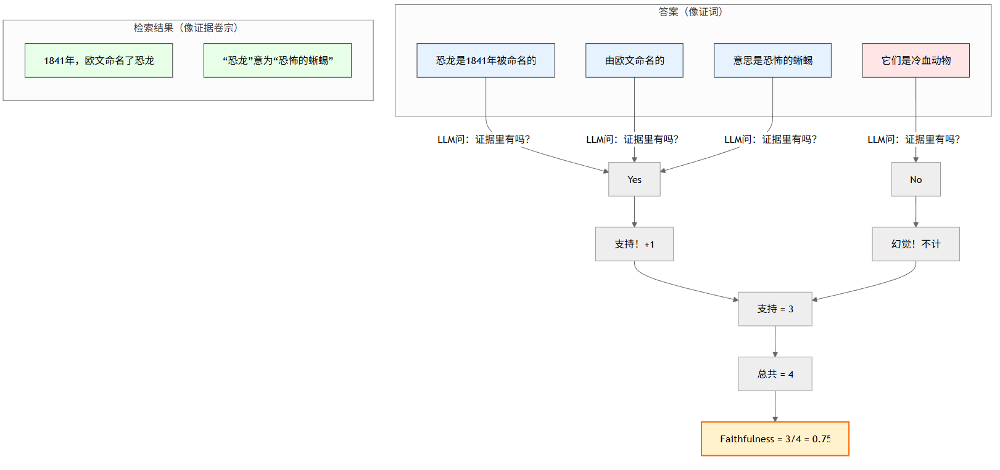
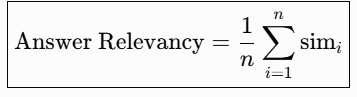
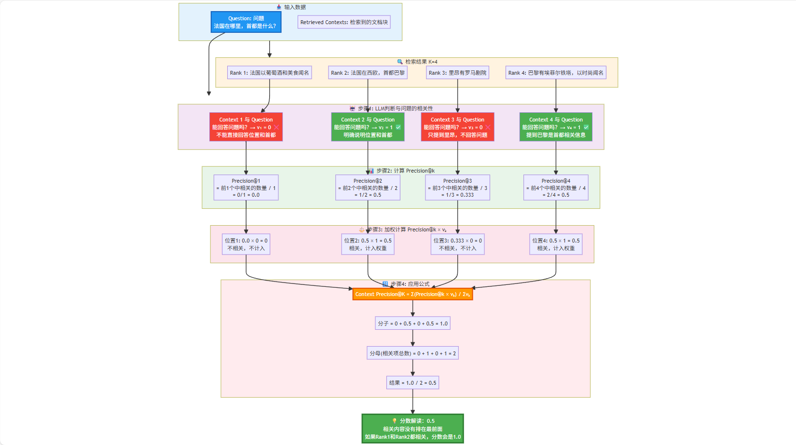
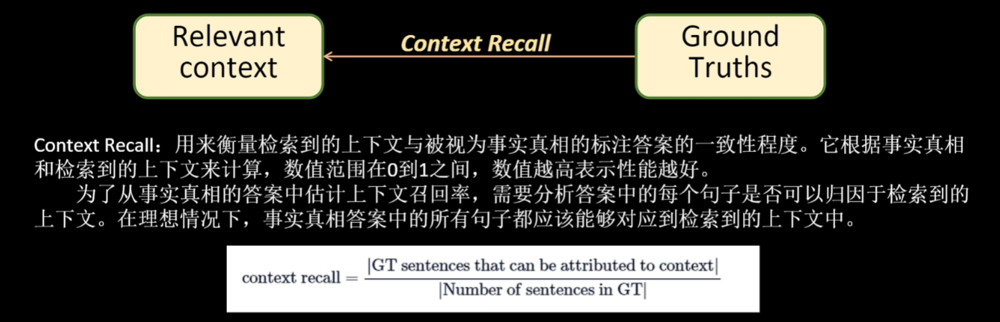

## RAG评估和应用平台 

**学习目标:**

1. 熟悉 RAG评估方式
2. 熟悉 RAG评估工具
3. 熟悉 RAG应用平台


### 一. RAG评估

- RAG评估是对基于检索增强生成模型（RAG）的性能进行评估和全面分析的过程。也就是去判断RAG他的能力怎么样。RAG有检索和生成的两种能力，用于对话系统和问答等任务中。 
- RAG评估的的目标是看检索相关文档和生成准确、连贯回答这方面的表现。
- 任何RAG系统的有效性和性能都严重依赖于这两个核心组件：**检索器和生成器**。检索器必须高效地识别和检索最相关的文档，而生成器应该使用检索到的信息生成连贯、相关和准确的响应。在部署之前，对这些组件进行严格评估对于确保RAG模型的最佳性能和可靠性至关重要。 

#### 1. 评估指标

- RAG评估的方式有很多种:
  - 检索评估(检索到的内容)
  - 响应评估(模型响应的内容)
  - 系统性能评估(执行的效率)
  - 鲁棒性评估(纠错机制)
  - ......
- 主要使用的是两种类型的评估
  - 检索评估
    - 精确度
    - 召回率
  - 响应评估
    - 忠诚度
    - 答案相关性

#### 2. 检索评估

- 检索评估的主要目标是评估上下文相关性，即检索到的文档与用户查询的匹配程度。它确保提供给生成组件的上下文是相关和准确的。 

##### 2.1 精确度

- 精确度衡量了检索到的文档的准确性。它是检索到的相关文档数量与检索到的文档总数之比。定义如下： 

  ​				 $$精确度=\frac{检索到的相关文档数量}{检索到的文档总数}$$

- 这意味着精确度评估了系统检索到的文档中有多少实际与用户查询相关。例如，如果检索器检索到了10个文档，其中7个是相关的，那么精确度将是0.7或70%。 

> 精确度评估的是“系统检索到的所有文档中，有多少实际上是相关的？

- 在可能导致负面后果的情况下，精确度尤为重要。例如，在医学信息检索系统中，高精确度至关重要，因为提供不相关的医学文档可能导致错误信息和潜在的有害结果。 

##### 2.2 召回率

- 召回率衡量了检索到的文档的覆盖率。它是检索到的相关文档数量与数据库中相关文档的总数之比。定义如下： 

  ​                             $$召回率=\frac{检索到的相关文档数量}{数据库中相关文档的总数}$$	 

> 假设：
>
> - 知识库中有 10 篇与问题相关的文档。
> - 模型检索到了 7 篇相关文档。
> - Recall=7/10=0.7

- 这意味着召回率评估了数据库中存在的相关文档有多少被系统成功检索到。 
- 召回率评估的是“数据库中存在的所有相关文档中，系统成功检索到了多少”
- 在可能错过相关信息会产生成本的情况下，召回率至关重要。例如，在法律信息检索系统中，高召回率至关重要，因为未能检索到相关的法律文件可能导致不完整的案例研究，并可能影响法律诉讼的结果。 

##### 2.3 F1分数

- F1分数用来平衡精确度和召回率，目标是找到适合特定应用需求的最佳平衡。F1分数是精确度和召回率的调和平均值： 

​                                       $$F1分数=2\frac{准确率 \times 召回率}{准确率 + 召回率}$$ 


- 合理区间

| **F1 范围** | **性能评价** | **适用阶段**        | **典型场景**           |
| ----------- | ------------ | ------------------- | ---------------------- |
| <0.5        | 需重大优化   | 模型原型/POC 阶段   | 初步实验、基线测试     |
| 0.5-0.7     | 基本可用     | 内部测试/非关键场景 | 内部工具、非核心功能   |
| 0.7-0.85    | 良好性能     | 准生产环境          | 电商推荐、客服问答     |
| 0.85-0.93   | 优秀性能     | 生产环境关键系统    | 金融风控、医疗辅助诊断 |
| >0.93       | 接近理论上限 | 高精度要求场景      | 工业质检、法律条款匹配 |

> F1 分数的合适值**没有绝对标准**，完全取决于**业务场景需求**、**数据特性**和**错误容忍度**。 


#### 3. 响应评估

- 响应评估适用于系统的生成组件。这些评估衡量系统根据检索到的文档提供的上下文有效地生成响应的能力。我们将响应评估分为两种类型： 

  - 忠实度

  

  - 答案相关性

  


### 二. 评估方法

#### 1. 人工评估

- 人工评估是RAG评估的基础方法，通过邀请专家或人工评估员对RAG生成的结果进行质量评估。评估标准通常包括准确性、连贯性、相关性等。尽管人工评估能够提供高质量的反馈，但这种方法耗时费力，且受限于评估员的主观性和经验差异。


#### 2. 自动化评估

- 自动化评估是当前RAG评估的主流和发展方向。通过利用大型语言模型和相关算法，自动化评估工具能够实现对RAG生成文本的质量评分，从而快速评估模型性能。这种方法不仅提高了评估效率，还降低了人力成本。 


### 三. 常用的评估工具介绍

- 目前开源社区已经出现了专业的工具，用户可以使用它们来方便快速进行定量评估。下面我们介绍目前比较常见好用的 RAG 评估工具，以及它们的一些特点。 

#### 1. Ragas

##### 1. 简介

- RAGAs是一个用于评测检索增强生成（RAG）应用的评测框架，它的核心目标是提供一套综合性的评测指标和方法，以量化地评测RAG管道(RAG Pipeline)在不同组件层面上的性能。RAGAs特别适用于那些结合了检索（Retrieval）和生成（Generation）两个主要组件的RAG系统，支持Langchain 和 Llama-Index。 

- 开源链接：https://github.com/explodinggradients/ragas

- 论文: https://arxiv.org/pdf/2309.15217

- 为了评估 RAG 系统，RAGAs 需要以下信息: 

  > question：用户输入的问题。
  >
  > answer：从 RAG 系统生成的答案(由LLM给出)。
  >
  > contexts：根据用户的问题从外部知识源检索的上下文即与问题相关的文档。
  >
  > ground_truths： 人类提供的基于问题的真实(正确)答案。 这是唯一的需要人类提供的信息。 


##### 2. 评估指标

- **四个评估指标** :
  - 评估检索质量：
    - context_precision（上下文相关性, 问题和检索内容的相关性）
    - context_recall（召回性，越高表示检索出来的内容与正确答案越相关）
  - 评估生成质量：
    - faithfulness（忠实性，越高表示答案的生成使用了越多的参考文档（检索出来的内容））
    - answer_relevancy（答案的相关性）


###### 2.1 faithfulness 


- 计算方式

  ​                       $$\text{Faithfulness} = \frac{\text{被上下文支持的声明数}}{\text{答案中的总声明数}}$$  

- 举例



- 实际效果
  - 把答案「拆成一条条小句子」→ 逐条去检索结果（contexts）里找 → 看每条是不是“原样出现”或“语义支持” → 统计比例 
  - Faithfulness = 检查大模型有没有「瞎编」不在检索结果里的内容 
- 优化方式:
  - 优化提示词对模型输出的内容进行约束  
  - 提高检索top_k值   

###### 2.2 answer_relevancy


- 计算方式 



- 举例:


- 实际效果:
  - Answer Relevancy = 答案越能「反问」出原问题 → 分数越高 
- 优化方式:
  - 预索引(问题拓展)


###### 2.3 context_precision


- 举例



- 实际效果
  - 评估对象：检索到的context与**问题(Question)**的相关性 
  - 判断标准：LLM判断每个context能否帮助回答问题 
  - 计算目标：衡量检索器是否把能回答问题的context排在前面 
  - 分数含义： 分数高 = 相关内容排序靠前 ✅ 分数低 = 相关内容排序靠后 ❌ 
- 优化方向:
  - 使用重排模型进行重新排序
  - 混合检索 
  - Query 改写与扩展 
  - 优化 Embedding 模型 

###### 2.4 context_recall



- 举例


- 实际效果
  - 需要 Ground Truth: Context Recall 必须有参考答案才能计算 
  - 评估召回能力: 衡量检索系统是否找到了所有必要信息 LLM 
  - 作为判断器: 使用 LLM 判断陈述是否被支持 
  - 原子化分解: Ground Truth 需要分解为独立的事实陈述 
  - 取值范围: 0-1，越接近 1 表示召回越完整 
- 优化方向
  - 增加 Top-K + Reranker 
  - 混合检索 
  - Query 改写与分解 
  - Parent Document Retriever 


#### 2. Trulens

- TruLens是一款旨在评估和改进 LLM 应用的软件工具，它相对独立，可以集成 LangChain 或 LlamaIndex 等 LLM 开发框架。它使用反馈功能来客观地衡量 LLM 应用的质量和效果。这包括分析相关性、适用性和有害性等方面。TruLens 提供程序化反馈，支持 LLM 应用的快速迭代，这比人工反馈更快速、更可扩展。 
- 开源链接：<https://github.com/truera/trulens> 


使用的步骤：

（1）创建LLM应用

（2）将LLM应用与TruLens连接，记录日志并上传

（3）添加 feedback functions到日志中，并评估LLM应用的质量

（4）在TruLens的看板中可视化查看日志、评估结果等

（5）迭代和优化LLM应用，选择最优的版本

**三个评估指标**

- 上下文相关性（context relevance）：衡量用户提问与查询到的参考上下文之间的相关性
- 忠实性（groundedness ）：衡量大模型生成的回复有多少是来自于参考上下文中的内容
- 答案相关性（answer relevance）：衡量用户提问与大模型回复之间的相关性


### 四. 评估案例

- 需要在RAGS网址注册token
- 网址: https://app.ragas.io

#### 4.1 模块安装

```
pip install ragas
```

#### 4.2 完整代码

```
import os
from dotenv import load_dotenv
from langchain_huggingface import HuggingFaceEmbeddings
from langchain_community.document_loaders import WebBaseLoader
from langchain.text_splitter import RecursiveCharacterTextSplitter
from langchain.retrievers import ParentDocumentRetriever
from langchain.storage import InMemoryStore
from langchain_chroma import Chroma
from langchain.prompts import ChatPromptTemplate
from langchain.schema.runnable import RunnableMap
from langchain.schema.output_parser import StrOutputParser
from langchain_openai import ChatOpenAI

load_dotenv()

# 创建BAAI的embedding
embedding_model_path = r'D:\LLM\Local_model\BAAI\bge-large-zh-v1___5'
bge_embeddings = HuggingFaceEmbeddings(model_name=embedding_model_path)
urls = "https://baike.baidu.com/item/%E6%81%90%E9%BE%99/139019"
loader = WebBaseLoader(urls)
docs = loader.load()

# 创建主文档分割器
parent_splitter = RecursiveCharacterTextSplitter(chunk_size=1000)

# 创建子文档分割器
child_splitter = RecursiveCharacterTextSplitter(chunk_size=400)

# 创建向量数据库对象
vectorstore = Chroma(
    collection_name="split_parents", embedding_function=bge_embeddings
)
# 创建内存存储对象
store = InMemoryStore()
# 创建父文档检索器
retriever = ParentDocumentRetriever(
    vectorstore=vectorstore,
    docstore=store,
    child_splitter=child_splitter,
    parent_splitter=parent_splitter,
    #     verbose=True,
    search_kwargs={"k": 2}
)

# 添加文档集
retriever.add_documents(docs)

chat = ChatOpenAI(
    model="qwen-plus",
    api_key=os.getenv("api_key"),
    base_url=os.getenv("base_url")
)

# 创建prompt模板
template = """你是负责回答问题的助手。使用以下检索到的上下文片段来回答问题。
如果你不知道答案，就说你不知道。最多用两句话，回答要简明扼要。
Question: {question} 
Context: {context} 
Answer:
"""

# 由模板生成prompt
prompt = ChatPromptTemplate.from_template(template)

# 创建chain
chain = RunnableMap({
    "context": lambda x: retriever.invoke(x["question"]),
    "question": lambda x: x["question"]
}) | prompt | chat | StrOutputParser()

from datasets import Dataset

# 问题
questions = ["恐龙是怎么被命名的？",
             "恐龙怎么分类的？",
             "体型最大的是哪种恐龙?",
             "体型最长的是哪种恐龙？它在哪里被发现？",
             "恐龙采样什么样的方式繁殖？",
             "恐龙是冷血动物吗？",
             "陨石撞击是导致恐龙灭绝的原因吗？",
             "恐龙是在什么时候灭绝的？",
             "鳄鱼是恐龙的近亲吗？",
             "恐龙在英语中叫什么？"
             ]
# 真实答案
ground_truths = [
    "1841年，英国科学家理查德·欧文在研究几块样子像蜥蜴骨头化石时，认为它们是某种史前动物留下来的，并命名为恐龙，意思是“恐怖的蜥蜴”。",
    "恐龙可分为鸟类和非鸟恐龙。",
    "恐龙整体而言的体型很大。以恐龙作为标准来看，蜥脚下目是其中的巨无霸。",
    "最长的恐龙是27米长的梁龙，是在1907年发现于美国怀俄明州。",
    "恐龙采样产卵、孵蛋的方式繁殖。",
    "恐龙是介于冷血和温血之间的动物",
    "科学家最新研究显示，0.65亿年前小行星碰撞地球时间或早或晚都可能不会导致恐龙灭绝，真实灭绝原因是当时恐龙处于较脆弱的生态系统中，环境剧变易导致灭绝。",
    "恐龙灭绝的时间是在距今约6500万年前，地质年代为中生代白垩纪末或新生代第三纪初。",
    "鳄鱼是另一群恐龙的现代近亲，但两者关系较非鸟恐龙与鸟类远。",
    "1842年，英国古生物学家理查德·欧文创建了“dinosaur”这一名词。英文的dinosaur来自希腊文deinos（恐怖的）Saurosc（蜥蜴或爬行动物）。"
    "对当时的欧文来说，这“恐怖的蜥蜴”或“恐怖的爬行动物”是指大的灭绝的爬行动物（实则不是）"
]
# 模型回答
answers = []
# 文档内容
contexts = []

# 把检索到的内容和回答的问题进行存储
for query in questions:
    answers.append(chain.invoke({"question": query}))
    contexts.append([docs.page_content for docs in retriever.invoke(query)])
print("question", questions)
print("answer", answers)
print("contexts", contexts)
print("ground_truth", ground_truths)
# 转换成字典
data_samples = {
    "question": questions,
    "answer": answers,
    "contexts": contexts,
    "ground_truth": ground_truths
}

# 字典转换为Dataset对象，便于高效处理数据并适配模型训练、评估等任务。
dataset = Dataset.from_dict(data_samples)

from ragas import evaluate
from ragas.metrics import (
    faithfulness,
    answer_relevancy,
    context_recall,
    context_precision,

)

# 进行评估
result = evaluate(
    dataset,
    metrics=[
        context_precision,
        context_recall,
        faithfulness,
        answer_relevancy,
    ],
    llm=chat,
    embeddings=bge_embeddings
)
df = result.to_pandas()
print(df)
df.to_csv('ragas_reval.csv', index=True)

```

#### 4.3 获取数据

```
# 创建BAAI的embedding
embedding_model_path = r'D:\LLM\Local_model\BAAI\bge-large-zh-v1___5'
bge_embeddings = HuggingFaceEmbeddings(model_name=embedding_model_path)
urls = "https://baike.baidu.com/item/%E6%81%90%E9%BE%99/139019"
loader = WebBaseLoader(urls)
docs = loader.load()

# 创建主文档分割器
parent_splitter = RecursiveCharacterTextSplitter(chunk_size=1000)

# 创建子文档分割器
child_splitter = RecursiveCharacterTextSplitter(chunk_size=400)

# 创建向量数据库对象
vectorstore = Chroma(
    collection_name="split_parents", embedding_function=bge_embeddings
)
# 创建内存存储对象
store = InMemoryStore()
# 创建父文档检索器
retriever = ParentDocumentRetriever(
    vectorstore=vectorstore,
    docstore=store,
    child_splitter=child_splitter,
    parent_splitter=parent_splitter,
    #     verbose=True,
    search_kwargs={"k": 2}
)

# 添加文档集
retriever.add_documents(docs)
```

#### 4.4 创建模型链接

```
chat = ChatOpenAI(
    model="qwen-plus",
    api_key=os.getenv("api_key"),
    base_url=os.getenv("base_url")
)

# 创建prompt模板
template = """你是负责回答问题的助手。使用以下检索到的上下文片段来回答问题。
如果你不知道答案，就说你不知道。最多用两句话，回答要简明扼要。
Question: {question} 
Context: {context} 
Answer:
"""

# 由模板生成prompt
prompt = ChatPromptTemplate.from_template(template)

# 创建chain
chain = RunnableMap({
    "context": lambda x: retriever.invoke(x["question"]),
    "question": lambda x: x["question"]
}) | prompt | chat | StrOutputParser()
```

#### 4.5 准备问答数据

- 问题和问题答案
- 模型检索内容和回答

```
from datasets import Dataset

# 问题
questions = ["恐龙是怎么被命名的？",
             "恐龙怎么分类的？",
             "体型最大的是哪种恐龙?",
             "体型最长的是哪种恐龙？它在哪里被发现？",
             "恐龙采样什么样的方式繁殖？",
             "恐龙是冷血动物吗？",
             "陨石撞击是导致恐龙灭绝的原因吗？",
             "恐龙是在什么时候灭绝的？",
             "鳄鱼是恐龙的近亲吗？",
             "恐龙在英语中叫什么？"
             ]
# 真实答案
ground_truths = [
    "1841年，英国科学家理查德·欧文在研究几块样子像蜥蜴骨头化石时，认为它们是某种史前动物留下来的，并命名为恐龙，意思是“恐怖的蜥蜴”。",
    "恐龙可分为鸟类和非鸟恐龙。",
    "恐龙整体而言的体型很大。以恐龙作为标准来看，蜥脚下目是其中的巨无霸。",
    "最长的恐龙是27米长的梁龙，是在1907年发现于美国怀俄明州。",
    "恐龙采样产卵、孵蛋的方式繁殖。",
    "恐龙是介于冷血和温血之间的动物",
    "科学家最新研究显示，0.65亿年前小行星碰撞地球时间或早或晚都可能不会导致恐龙灭绝，真实灭绝原因是当时恐龙处于较脆弱的生态系统中，环境剧变易导致灭绝。",
    "恐龙灭绝的时间是在距今约6500万年前，地质年代为中生代白垩纪末或新生代第三纪初。",
    "鳄鱼是另一群恐龙的现代近亲，但两者关系较非鸟恐龙与鸟类远。",
    "1842年，英国古生物学家理查德·欧文创建了“dinosaur”这一名词。英文的dinosaur来自希腊文deinos（恐怖的）Saurosc（蜥蜴或爬行动物）。"
    "对当时的欧文来说，这“恐怖的蜥蜴”或“恐怖的爬行动物”是指大的灭绝的爬行动物（实则不是）"
]
# 模型回答
answers = []
# 文档内容
contexts = []

# 把检索到的内容和回答的问题进行存储
for query in questions:
    answers.append(chain.invoke({"question": query}))
    contexts.append([docs.page_content for docs in retriever.invoke(query)])
print("question", questions)
print("answer", answers)
print("contexts", contexts)
print("ground_truth", ground_truths)
# 转换成字典
data_samples = {
    "question": questions,
    "answer": answers,
    "contexts": contexts,
    "ground_truth": ground_truths
}
```

#### 4.6 进行评估

```
# 字典转换为Dataset对象，便于高效处理数据并适配模型训练、评估等任务。
dataset = Dataset.from_dict(data_samples)

from ragas import evaluate
from ragas.metrics import (
    faithfulness,
    answer_relevancy,
    context_recall,
    context_precision,

)

# 进行评估
result = evaluate(
    dataset,
    metrics=[
        context_precision,
        context_recall,
        faithfulness,
        answer_relevancy,
    ],
    llm=chat,
    embeddings=bge_embeddings
)
df = result.to_pandas()
print(df)
df.to_csv('ragas_reval.csv', index=True)

```


### 五. 优化方式

| 评估维度                          | 定义                     | 优化目标              | 关键技术方案                                                 |
| :-------------------------------- | ------------------------ | --------------------- | :----------------------------------------------------------- |
| **精确度** (Context Precision)    | 检索结果与问题的相关比例 | 提升TOP-K结果的精准性 | 1. 混合检索策略（向量+关键词+图）<br />2. 嵌入模型微调（领域适配） <br />3. 重排序模型 |
| **召回率** (Context Recall)       | 关键信息是否被完整检索   | 覆盖核心证据文档      | 1. 多粒度分块（父子索引） <br />2. 多条检索                  |
| **忠诚度** (Faithfulness)         | 生成答案与检索内容一致性 | 消除幻觉/矛盾         | 1. 尽量避免噪声数据 <br />2. 模型调试 <br />3. 提示词合理    |
| **答案相关性** (Answer Relevance) | 回答与问题匹配度         | 提升语义匹配完整性    | 1. 指令微调 <br />2. 拒绝回答机制 <br />3. 偏好优化          |


### 六. RAG应用平台

- 工作流平台的核心作用是**通过自动化、标准化和可视化手段，简化复杂任务的编排与管理**，从而提升效率、降低协作成本，并确保流程的可控性,对比四个知名平台：Dify、FastGPT、RagFlow和QAnything，以帮助用户理解它们的功能、优势和适用场景。 
- 优缺点:

| **维度**         | **RAG开发**                              | **RAG工作流平台**                    |
| ---------------- | ---------------------------------------- | ------------------------------------ |
| 开发速度         | ❌ 慢（需全链路实现）                     | ✅ 快（开箱即用）                     |
| 定制化能力       | ✅ 高（完全自主控制）                     | ❌ 低（受限于平台功能）               |
| 工程复杂度       | ❌ 高（需处理部署、监控等）               | ✅ 低（平台自动化管理）               |
| 维护成本         | ❌ 高（需持续优化底层）                   | ✅ 低（平台负责升级）                 |
| **性能调优能力** | ✅ 强（可针对硬件/场景深度优化）          | ❌ 弱（受限于平台默认配置）           |
| **数据隐私控制** | ✅ 完全自主（本地化部署，无数据外流）     | ❌ 受限（依赖平台数据托管策略）       |
| 适用场景         | 超大规模、高定制化需求（如企业级知识库） | 中小规模、快速验证需求（如MVP或PoC） |

#### 1. QAnything 

- QAnything(Question 和 Answer based on Anything）是网易一个开源的本地知识库RAG问答系统，支持用户上传多种格式的文档，以构建知识库，并采用**两阶段检索**机制及**混合检索**技术，提升检索效率和准确性。 


- 与常规的 RAG 流程图相比，明显更加突出了 `Rerank` 环节，将 `Rerank` 作为 `2nd Retrieval` 进行强调，看起来这是有道对 RAG 的独到理解。 
- 另外 [QAnything 官方文档](https://github.com/netease-youdao/QAnything/tree/master?tab=readme-ov-file#rag-evaluations-in-llamaindexembedding-and-rerank) 中也强调，QAnything 使用的向量检索模型 `bce-embedding-base_v1` 向量排序模型 `bce-reranker-base_v1` 组合才是 SOTA。同样也印证了架构图， `Rerank` 是 QAnything 是相当重要的模块。
- 源码地址：https://github.com/netease-youdao/QAnything/
- 官方网址：https://qanything.ai/


#### 2. RagFlow

- RAGFlow 是一个基于对文档的深入理解的开源 RAG（检索增强生成）引擎。当与大语言模型集成时，它能凭借引用知识库中各种复杂格式的数据为后盾，为用户提供真实可信，少幻觉的答案。RAGFlow的技术原理涵盖了文档理解、检索增强、生成模型、注意力机制等，特别强调了深度文档理解技术，能够从复杂格式的非结构化数据中提取关键信息。 


- 可以看到右侧知识库被明显放大，同时最右侧详细介绍了文件解析的各种手段，比如 OCR， Document Layout Analyze 等，这些在常规的 RAG 中可能会作为一个不起眼的 Unstructured Loader 包含进去，可以猜到 RagFlow 的一个核心能力在于文件的解析环节。 
- 在 [官方文档](https://github.com/infiniflow/ragflow?tab=readme-ov-file#-key-features) 中也反复强调 Quality in, quality out, 反映出 RAGFlow 的独到之处在于细粒度文档解析。
- 另外 [介绍文章](https://www.aigcopen.com/content/corporate_news/23689.html) 中提到其没有使用任何 RAG 中间件，而是完全重新研发了一套智能文档理解系统，并以此为依托构建 RAG 任务编排体系，也可以理解文档的解析是其 RagFlow 的核心亮点。
- 源码地址：https://github.com/infiniflow/ragflow
- 官方网址：https://ragflow.io/


#### 3. FastGPT

- FastGPT是一款基于LLM（Large Language Model）大语言模型的知识库问答系统。它提供了数据处理、模型调用、RAG（Retriever-Augmented Generation）检索、可视化AI工作流编排等能力，使用户能够轻松构建复杂的AI应用。FastGPT不仅支持多轮对话，还能处理实时信息和企业内部资料，极大地提高了AI应用的实用性和效率。
- 与常规的 RAG 相比增加了额外工作流编排的能力，这部分类似 Dify。但是相对 Dify 而言可调用的第三方应用更少一些。按照习惯先查看项目的架构图：


对于常规的 RAG 架构图，这张图可以明显看到大模型模块被放大，而且文件入库的流程都会先调用大模型。从大模型的输出来看，存在 QA 拆分，文本分段和手动输入三种情况： 

- 文本分段是常规的 RAG 的处理方案
- QA 拆分看起来是基于原始文本生成问答对，这部分猜测应该是根据大模型生成问答对，之前 Dify 也有类似的功能，被称为 Q&A 模式
- 手动输入则是直接输入问答对，这部分应该是手工输入数据进行补充

预计文件入库环节的大模型调用主要作用于 QA 拆分。              

源码地址：https://github.com/labring/FastGPT

官方网址：https://tryfastgpt.ai/


#### 4. dify本地加载

- Dify是一个流行的开源大模型应用开发平台，内置了构建 LLM 应用所需的关键技术栈，包括对数百个模型的支持、直观的 Prompt 编排界面、高质量的 RAG 引擎、稳健的 Agent 框架、灵活的流程编排，并同时提供了一套易用的界面和 API。这为开发者节省了许多重复造轮子的时间，使其可以专注在创新和业务需求上。 
- 基于 Dify 可以在不需要太多开发的情况下，快速搭建一个大模型应用。应用中可以调用 Dify 中内置的大量基础能力，比如知识库检索 RAG，大模型调用。通过可插拔式的组合构建大模型应用。一个典型的应用如下所示： 


- Dify源码地址：[https://github.com/langgenius/dify](https://link.zhihu.com/?target=https%3A//github.com/langgenius/dify)
- 中文文档：[https://docs.dify.ai/v/zh-hans](https://link.zhihu.com/?target=https%3A//docs.dify.ai/v/zh-hans)

##### 4.1 安装docker

- 电脑版本需要再win10 **19044+** 以上才行

- 安装教程：https://www.runoob.com/docker/windows-docker-install.html
- 配置国内镜像源：https://blog.csdn.net/qq_23311271/article/details/146259874

##### 4.2 项目下载


- docker拉环境

